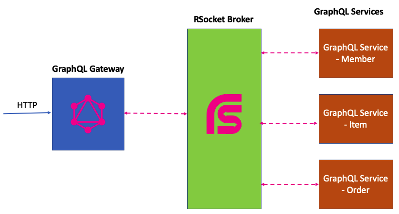

RSocket GraphQL Gateway
=======================

RSocket GraphQL Gateway is an HTTP entrance to access GraphQL Services that register on RSocket Broker.



# Features

* Load balance support for GraphQL Service
* Access GraphQL Service by RSocket
* Query merge support

# Modules

* rsocket-graphql-gateway: 基于RSocket的GraphQL HTTP Gateway
* graphql-service-provider: GraphQL的RSocket服务提供者，使用Netflix DGS框架
* graphql-rsocket-support: 支持GraphQL服务快速接入到RSocket Broker

# How to start?

* Start the RSocket Broker: `docker-compose up -d`
* Start the graphql-rsocket-provider
* Start the rsocket-graphql-gateway
* Please visit index.http and test

# 工作原理

对于GraphQL来说，服务接口非常简单，就是 "com.alibaba.rsocket.graphql.GraphqlRSocketExecutor"，所有的GraphQL服务都是以该接口对外发布。
那么不同的GraphQL服务如何来区分，如会员和商品就是不同的GraphQL服务分组。 这里我们使用RSocket服务的group概念，不同GraphQL服务分组使用不同的group，
如果会员GraphQL服务使用"user" group, 商品GraphQL服务使用"item" group，这样我们就可以区分开不同的服务。

在GraphQL Gateway，我们也使用分组作为服务的namespace，具体解释如下：

* namespace: 如 `user`，对应于GraphQL的服务分组， 在Gateway上对应的HTTP地址为 `http://localhost:8383/user/graphql`
* routing: 不同的namespace会路由到对应的服务提供者

如何设置GraphQL服务的分组信息？ 如何将GraphQL对应的schema提交给RSocket Broker？ 你只需要在`application.properties` 添加以下设置：

```
rsocket.group=user
rsocket.metadata.graphqls=classpath:schema/schema.graphqls
```

# GraphQL Reactive support

### DGS

DGS 4.2.0版本后添加了Data Fetch的Mono/Flux返回类型支持，所以Reactive就内置啦，样例代码如下：

```
    @DgsQuery(field = "bookById")
    public Mono<Book> bookById(@InputArgument String id) {
        Book book = BOOKS.get(id);
        if (book == null) {
            return Mono.empty();
        } else {
            return Mono.just(book);
        }
    }
```

如果是列表类型，返回Flux就可以啦。

### GraphQL Java

* 异步执行graphQL.executeAsync()，将 CompletableFuture 转换为Mono

```
  public Mono<Object> execute(ExecutionInput executionInput) {
        CompletableFuture<ExecutionResult> future = graphQL.executeAsync(executionInput);
        return Mono.fromFuture(future).map(ExecutionResult::getData);
    }
```

*  DataFetcher with CompletableFuture<T> Generic type

```
public DataFetcher<CompletableFuture<Map<String, Object>>> bookById() {
        return dataFetchingEnvironment -> {
            String bookId = dataFetchingEnvironment.getArgument("id");
            return Flux.fromIterable(BOOKS)
                    .filter(book -> book.get("id").equals(bookId))
                    .next()
                    .toFuture();
        };
    }
```

通过这两种方式，就可以非常方便地支持GraphQL查询的异步化。当然CompletableFuture和Reactive之间转换也就非常简单啦。

# GraphQL gateway职责

* 查询所有GraphQL服务提供方的schema结构，确保这些服务提供方的GraphQL schema不会冲突。
* 通过调用GraphQL服务提供方的API完成对相关服务的验证。
* 当请求到达gateway时，Gateway要负责基于Query/Mutation完成对应的服务匹配
* 并行执行服务调用，等待服务响应。可以考虑Reactive方案，也就是flatmap。
* 对响应的数据进行合并处理，然后返回给请求方；如果有错误的话，也要进行返回。

# 如何合并多个GraphQL schema?

我们只需要执行TypeDefinitionRegistry的merge操作即可。

```
TypeDefinitionRegistry typeDefinitionRegistry1 = new SchemaParser().parse(schema1);
TypeDefinitionRegistry typeDefinitionRegistry2 = new SchemaParser().parse(schema2);
TypeDefinitionRegistry mergedDefinitionRegistry = typeDefinitionRegistry1.merge(typeDefinitionRegistry2);
```

# Gateway如何路由请求GraphQL请求？
对应GraphQL Gateway来说，其本身并不程度具体的GraphQL请求执行，而是将请求转发给下游的GraphQL服务方，这个时候只需要为Type类型提供一个默认的DataFetcher，然后该默认的DataFetcher再和远程GraphQL进行交互，完成数据的返回，如下：

```
  RuntimeWiring runtimeWiring = RuntimeWiring.newRuntimeWiring()
                .type("Query", builder -> builder.defaultDataFetcher(dfe -> { ... }))
                .build();
```

Gateway会维护一个合并后的大的GraphQL Schema，所以对每一个Query/Mutation请求来说，Gateway都能跟踪到query field的原始来源，然后再将请求发给远程的GraphQL服务即可。

# References

* Alibaba RSocket Broker: https://github.com/alibaba/alibaba-rsocket-broker
* GraphQL Specification: https://spec.graphql.org/June2018/
* GraphQL Java: https://www.graphql-java.com/
* Netflix DGS: https://netflix.github.io/dgs/
* How Netflix Scales its API with GraphQL Federation: https://netflixtechblog.com/how-netflix-scales-its-api-with-graphql-federation-part-1-ae3557c187e2 https://netflixtechblog.com/how-netflix-scales-its-api-with-graphql-federation-part-2-bbe71aaec44a